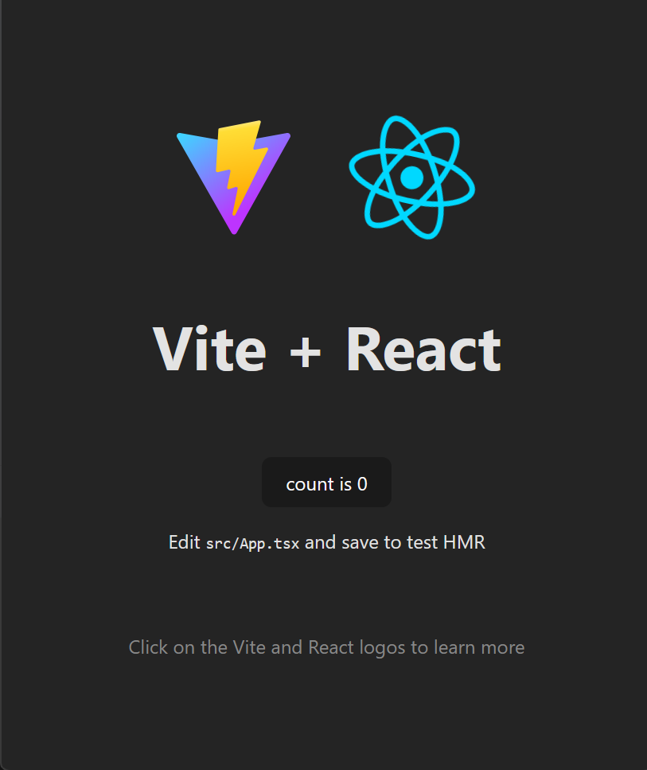

# Project Setup Guide

< [back](../README.md)

---

## Prerequisites

Voordat je begint, zorg dat je deze tools geïnstalleerd hebt:

* [Node.js](https://nodejs.org/en) (JavaScript-runtime)
* Git (versiebeheer)
* Een code-editor (IDE), zoals:
    * [Visual Studio Code](https://code.visualstudio.com/)
    * [WebStorm](https://www.jetbrains.com/webstorm/)

---

## Creating a New Vite + React Project

Open je terminal en volg deze stappen:

1. Navigeer naar (of maak) een lege map voor je project.

2. Open deze map in je editor (VSCode of WebStorm).

3. Open de terminal in de editor.

4. Voer het volgende commando uit om een Vite-project te starten:

```bash
   npm create vite@latest
```

5. Er verschijnt een installatie-wizard:

    * Gebruik een punt `.` als projectnaam (om de huidige map te gebruiken)
    * Als er gevraagd wordt om bestaande bestanden te overschrijven, kies **Ignore**
    * Kies een pakketnaam (of laat leeg)
    * Selecteer **React** als framework
    * Selecteer **TypeScript** als variant

6. Als de wizard klaar is, installeer dan de dependencies:

   ```bash
   npm install
   ```

7. Start de ontwikkelserver:

   ```bash
   npm run dev
   ```

---

## Resultaat

Als alles gelukt is, start Vite je nieuwe React-app op:

```
http://localhost:5173
```

Je zou een pagina moeten zien zoals deze:



---

## 🔗 Meer Leren

* [Vite Documentatie](https://vitejs.dev/)
* [React Documentatie](https://reactjs.org/)
