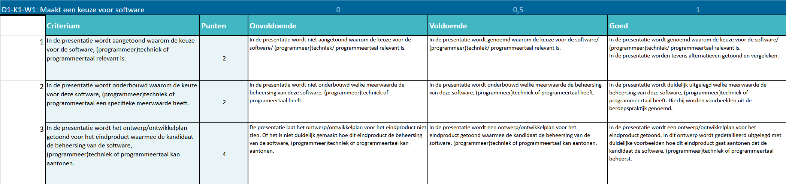
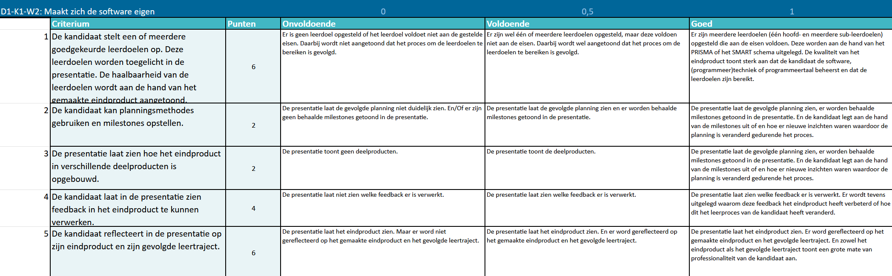

# Criterium
< [back](../README.md)

---

## D1-K1-W1: Maakt een keuze voor software

---

### 🔹 In de presentatie wordt aangetoond waarom de keuze voor de software, (programmeer)techniek of programmeertaal relevant is.
*2 punten*

| Beoordeling | Vereisten                                                                                                                                                                                  |
|:-----------:|--------------------------------------------------------------------------------------------------------------------------------------------------------------------------------------------|
|      O      | In de presentatie wordt niet aangetoond waarom de keuze voor de software/ (programmeer)techniek/ programmeertaal relevant is.                                                              |
|      V      | In de presentatie wordt genoemd waarom de keuze voor de software/ (programmeer)techniek/ programmeertaal relevant is.                                                                      |
|      G      | In de presentatie wordt genoemd waarom de keuze voor de software/ (programmeer)techniek/ programmeertaal relevant is. In de presentatie worden tevens alternatieven getoond en vergeleken. |

### 🔹 In de presentatie wordt onderbouwd waarom de keuze voor deze software, (programmeer)techniek of programmeertaal een specifieke meerwaarde heeft.
*2 punten*

| Beoordeling | Vereisten                                                                                                                                                                             |
|:-----------:|---------------------------------------------------------------------------------------------------------------------------------------------------------------------------------------|
|      O      | In de presentatie wordt niet onderbouwd welke meerwaarde de beheersing van deze software, (programmeer)techniek of programmeertaal heeft.                                             |
|      V      | In de presentatie wordt onderbouwd welke meerwaarde de beheersing van deze software, (programmeer)techniek of programmeertaal heeft.                                                  |
|      G      | In de presentatie wordt duidelijk uitgelegd welke meerwaarde de beheersing van deze software, (programmeer)techniek of programmeertaal heeft, met voorbeelden uit de beroepspraktijk. |

### 🔹 In de presentatie wordt het ontwerp/ontwikkelplan getoond voor het eindproduct waarmee de kandidaat de beheersing van de software, (programmeer)techniek of programmeertaal kan aantonen.
*4 punten*

| Beoordeling | Vereisten                                                                                                                                                                                                                                                               |
|:-----------:|-------------------------------------------------------------------------------------------------------------------------------------------------------------------------------------------------------------------------------------------------------------------------|
|      O      | De presentatie laat het ontwerp/ontwikkelplan voor het eindproduct niet zien. Of het is niet duidelijk gemaakt hoe dit eindproduct de beheersing van de software, (programmeer)techniek of programmeertaal kan aantonen.                                                |
|      V      | In de presentatie wordt een ontwerp/ontwikkelplan voor het eindproduct getoond waarmee de kandidaat de beheersing van de software, (programmeer)techniek of programmeertaal kan aantonen.                                                                               |
|      G      | In de presentatie wordt een ontwerp/ontwikkelplan voor het eindproduct getoond. In dit ontwerp wordt gedetailleerd uitgelegd, met duidelijke voorbeelden, hoe dit eindproduct aantoont dat de kandidaat de software, (programmeer)techniek of programmeertaal beheerst. |

### Visueel Schema:

---

## D1-K1-W2: Maakt zich de software eigen

### 🔹 De kandidaat stelt een of meerdere goedgekeurde leerdoelen op. Deze leerdoelen worden toegelicht in de presentatie. De haalbaarheid van de leerdoelen wordt aan de hand van het gemaakte eindproduct aangetoond.
*6 punten*

| Beoordeling | Vereisten                                                                                                                                                                                                                                      |
|:-----------:|------------------------------------------------------------------------------------------------------------------------------------------------------------------------------------------------------------------------------------------------|
|      O      | Er is geen leerdoel opgesteld of het leerdoel voldoet niet aan de gestelde eisen. Daarbij wordt niet aangetoond dat het proces om de leerdoelen te bereiken is gevolgd.                                                                        |
|      V      | Er zijn wel één of meerdere leerdoelen opgesteld, maar deze voldoen niet aan de eisen. Daarbij wordt wel aangetoond dat het proces om de leerdoelen te bereiken is gevolgd.                                                                    |
|      G      | Er zijn meerdere leerdoelen (één hoofd- en meerdere sub-leerdoelen) opgesteld die aan de eisen voldoen. Deze worden aan de hand van het PRISMA- of SMART-schema uitgelegd. Het eindproduct toont duidelijk aan dat de leerdoelen zijn bereikt. |

### 🔹 De kandidaat kan planningsmethodes gebruiken en milestones opstellen.
*2 punten*

| Beoordeling | Vereisten                                                                                                                                                                                                                                            |
|:-----------:|------------------------------------------------------------------------------------------------------------------------------------------------------------------------------------------------------------------------------------------------------|
|      O      | De presentatie laat de gevolgde planning niet duidelijk zien. En/of er zijn geen behaalde milestones getoond in de presentatie.                                                                                                                      |
|      V      | De presentatie laat de gevolgde planning zien en er worden behaalde milestones getoond in de presentatie.                                                                                                                                            |
|      G      | De presentatie laat de gevolgde planning zien, er worden behaalde milestones getoond in de presentatie. De kandidaat legt aan de hand van de milestones uit hoe nieuwe inzichten hebben geleid tot aanpassingen in de planning gedurende het proces. |

### 🔹 De presentatie laat zien hoe het eindproduct in verschillende deelproducten is opgebouwd.
*2 punten*

| Beoordeling | Vereisten                                                                                                                                                                               |
|:-----------:|-----------------------------------------------------------------------------------------------------------------------------------------------------------------------------------------|
|      O      | De presentatie toont geen deelproducten.                                                                                                                                                |
|      V      | De presentatie toont de deelproducten.                                                                                                                                                  |
|      G      | De presentatie toont de deelproducten, inclusief toelichting over hun rol binnen het eindproduct. Daarbij wordt uitgelegd hoe de deelproducten samenhangen en bijdragen aan het geheel. |

### 🔹 De kandidaat laat in de presentatie zien feedback in het eindproduct te kunnen verwerken.
*4 punten*

| Beoordeling | Vereisten                                                                                                                                                                        |
|:-----------:|----------------------------------------------------------------------------------------------------------------------------------------------------------------------------------|
|      O      | De presentatie laat niet zien welke feedback er is verwerkt.                                                                                                                     |
|      V      | De presentatie laat zien welke feedback er is verwerkt.                                                                                                                          |
|      G      | De presentatie laat zien welke feedback er is verwerkt. Daarnaast wordt uitgelegd waarom deze feedback het eindproduct heeft verbeterd of wat het betekende voor het leerproces. |

### 🔹 De kandidaat reflecteert in de presentatie op zijn eindproduct en zijn gevolgde leertraject.
*6 punten*

| Beoordeling | Vereisten                                                                                                                                                                                |
|:-----------:|------------------------------------------------------------------------------------------------------------------------------------------------------------------------------------------|
|      O      | De presentatie laat het eindproduct zien, maar er wordt niet gereflecteerd op het gemaakte eindproduct en het gevolgde leertraject.                                                      |
|      V      | De presentatie laat het eindproduct zien en er wordt gereflecteerd op het gemaakte eindproduct en het gevolgde leertraject.                                                              |
|      G      | De presentatie laat het eindproduct zien, met een reflectie op het product en het leertraject. Deze reflectie toont een hoge mate van professionaliteit en zelfinzicht van de kandidaat. |

### Visueel Schema:

---

## Tips & Tricks
- Begin op tijd en gebruik een planningstool (zoals Trello).
- Laat je ontwerp, keuzes en planning visueel zien (screenshots, diagrammen, schema’s).
- Vraag actief om feedback tijdens het proces – niet pas op het einde.
- Gebruik korte, duidelijke zinnen op slides. Jij doet het verhaal.
- Gebruik deze schemas als een check-list, kruis af wat je ondertussen gedaan hebt.