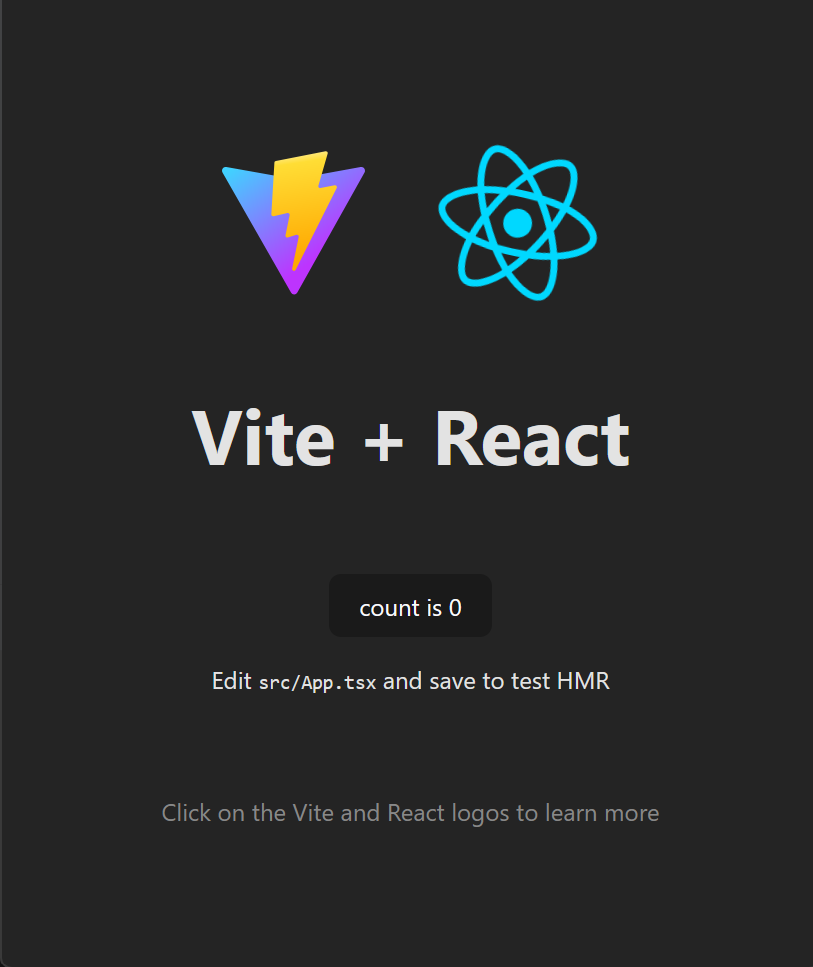

# Project Setup Guide
<< [back](../README.md)

---

## Prerequisites
- [Node.js](https://nodejs.org/en)
- Git
- Code editor
  - [VSCode](https://code.visualstudio.com/)
  - [Webstorm](https://www.jetbrains.com/webstorm/)

## Creating a New Vite-React Project

1. Clone your project in a new folder of your pc
2. Open your (empty) project with your chosen IDE
3. Open Terminal
4. Type the following command:
```bash
npm create vite@latest
```
5. A wizard will now open.
    - Use a singular dot `.` as the project name (this will pick your current folder as the root)
    - if it asks to overwrite the content of the folder, pick ignore (to not overwrite your git project)
    - Pick a Package name (leave empty to use folder name)
    - Select `React` as the framework
    - Select `Typescript` as the variant
6. After the wizard is finished, type the following command:
```bash
npm install
```
7. Your project is now set up, test it out with the command:
```bash
npm run dev
```

## Result
If all has gone well, it should result in `http://localhost:5173` leading to the following web-page:



